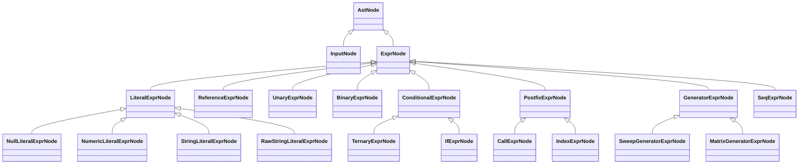

# REL AST 节点类型设计（继承版）

本文依据 `REL.md` 与 `REL_Formal_Spec.md`，给出面向实现的 AST 节点类型设计。
目标是先统一语法结构建模，再在语义阶段补充判定，减少语法歧义并保持可扩展性。

## 1. 设计原则

1. AST 只表达结构，不在节点层直接做求值。
2. 解析阶段尽量保留原始字面信息（如数值后缀、字符串原文），避免过早归一化丢失信息。
3. 对同形结构采用统一节点，语义阶段再区分。例如：`a(...)` 既可能是函数调用，也可能是矩阵索引。
4. `::` 序列统一建模为一个节点，不在解析阶段按上下文拆散。
5. 条件表达式支持两种形态：`if-then-elseif-else` 与 `?:`，分别建模，避免语义混淆。

## 2. 顶层继承结构

## 3. 公共基类与通用元信息

### 3.1 AstNode（抽象基类）

建议通用字段：

- `node_id`：节点唯一 ID（便于调试和错误追踪）。
- `kind`：节点种类枚举。
- `span`：源码范围（起止位置）。
- `leading_trivia` / `trailing_trivia`（可选）：保留格式化或报错上下文。

### 3.2 InputNode（顶层根节点）

对应文法：`<input> ::= <expr> <eof>`

字段建议：

- `expr: ExprNode`。
- `has_eof: bool`（通常恒为真，用于鲁棒解析场景）。

### 3.3 ExprNode（表达式抽象基类）

所有可求值表达式节点的统一父类。

## 4. 具体节点类型

## 4.1 字面量节点

### 4.1.1 LiteralExprNode（抽象）

对应文法：`<literal>`

### 4.1.2 NullLiteralExprNode

对应：`KW_NULL`

字段建议：

- 无额外字段（或保留 token 文本）。

### 4.1.3 NumericLiteralExprNode

对应：`<numeric_literal> ::= <numeric_base> <numeric_suffix_opt>`

字段建议：

- `raw_text`：原始字面量文本。
- `base_kind`：十进制/十六进制/八进制/实数/虚数。
- `base_value_text`：基础数值部分原文。
- `suffix`：可选，类型为 `NumericSuffix`。

`NumericSuffix` 建议结构：

- `suffix_kind`：`predefined_scaled_unit` / `scale_factor_with_optional_unit` / `unit_only`。
- `predefined_scaled_unit`：可选。
- `scale_factor`：可选。
- `unit`：可选。

### 4.1.4 StringLiteralExprNode

对应：`STRING_DQ`

字段建议：

- `raw_text`：含引号原文。
- `decoded_value`：解码后的值（可在后处理填充）。

### 4.1.5 RawStringLiteralExprNode

对应：`STRING_RAW_DQ2`

字段建议：

- `raw_text`：含外层 `''` 的原文。
- `value`：去外层界定符后的原样文本。

## 4.2 引用节点

### 4.2.1 ReferenceExprNode

对应文法：

- `<reference> ::= IDENTIFIER <reference_tail>`
- `<reference_tail> ::= DOT IDENTIFIER ... | DDOT IDENTIFIER ... | <empty>`

字段建议：

- `segments`：标识符段列表。
- `joins`：段间连接符列表（`.` 或 `..`），长度应为 `segments.size - 1`。

说明：

- 不在 AST 阶段强行判定是 Dataset/Analysis/Variable 哪一段。
- `Dataset..Variable` 的唯一性约束在语义阶段校验。

## 4.3 一元与二元运算节点

### 4.3.1 UnaryExprNode

对应：`<unary_expr> ::= <unary_op> <unary_expr> | <power_expr>`

字段建议：

- `op`：`!` / `NOT` / `~` / `-`。
- `operand: ExprNode`。

### 4.3.2 BinaryExprNode

覆盖：逻辑、按位、比较、移位、算术、幂。

字段建议：

- `op`：二元运算符枚举。
- `left: ExprNode`。
- `right: ExprNode`。
- `associativity`（可选缓存）：左结合或右结合。

说明：

- `**` 在解析时按右结合构树。
- 其余二元运算符按文法层级和左结合构树。

## 4.4 条件表达式节点

### 4.4.1 ConditionalExprNode（抽象）

统一父类，覆盖 `if` 族与三元运算。

### 4.4.2 TernaryExprNode

对应：`<conditional_tail> ::= ? <expr> : <conditional_expr>`

字段建议：

- `condition: ExprNode`。
- `then_expr: ExprNode`。
- `else_expr: ExprNode`。

### 4.4.3 IfExprNode

对应：`if (...) then ... elseif (...) then ... else ...`

字段建议：

- `if_condition: ExprNode`。
- `if_then_expr: ExprNode`。
- `elseif_branches`：列表，元素类型 `ElseIfBranchNode`。
- `else_expr: ExprNode`。

`ElseIfBranchNode` 建议字段：

- `condition: ExprNode`。
- `then_expr: ExprNode`。

## 4.5 后缀节点（调用与索引）

### 4.5.1 PostfixExprNode（抽象）

用于表达以某个目标表达式为基底的后缀链。

### 4.5.2 CallExprNode

对应：`LPAREN <call_arg_list_opt> RPAREN`

字段建议：

- `callee: ExprNode`。
- `args`：`ArgumentSlotNode` 列表。

`ArgumentSlotNode` 建议字段：

- `is_omitted`：是否缺省参数槽。
- `value: ExprNode?`：当 `is_omitted=false` 时必填。

说明：

- `func()` 合法，表示空参数列表。
- 缺省槽规则（不得纯缺省、不得尾随缺省）建议在语义校验阶段处理并可在解析末进行快速校验。

### 4.5.3 IndexExprNode

对应：`LBRACKET <index_list> RBRACKET` 和“矩阵索引形态”的 `()`。

字段建议：

- `target: ExprNode`。
- `indices`：`SeqExprNode` 列表。
- `bracket_kind`：`square` 或 `round`。

说明：

- `a[i][j]`、`a(i,j)` 都可表示为后缀链。
- `a(...)` 是函数调用还是矩阵索引，由语义阶段根据 `a` 的类型判定。

## 4.6 生成器与序列节点

### 4.6.1 GeneratorExprNode（抽象）

统一 sweep/matrix 生成器节点。

### 4.6.2 SweepGeneratorExprNode

对应：`[<item_list>]`

字段建议：

- `items`：`SeqExprNode` 列表。

### 4.6.3 MatrixGeneratorExprNode

对应：`{<item_list>}`

字段建议：

- `items`：`SeqExprNode` 列表。

### 4.6.4 SeqExprNode

对应：

- `::`
- `start::stop`
- `start::step::stop`

字段建议：

- `form`：`all_or_empty` / `start_stop` / `start_step_stop`。
- `start: ExprNode?`
- `step: ExprNode?`
- `stop: ExprNode?`

上下文语义：

- 在索引上下文中，裸 `::` 表示“该维全选”。
- 在生成器上下文中，裸 `::` 表示空序列。

## 5. 语法到 AST 的映射建议

1. `<expr>` 直接落到 `ExprNode` 子类。
2. 各优先级层级通常归并到 `UnaryExprNode` / `BinaryExprNode` / `ConditionalExprNode`。
3. `<postfix_tail>` 采用循环构建后缀链，每读到一个后缀生成一个新节点，以上一轮表达式作为 `target/callee`。
4. `<reference>` 解析成 `ReferenceExprNode` 的 `segments + joins`，不提前解释段语义。
5. `<seq_expr>` 一律解析为 `SeqExprNode`，不要拆成多种列表元素节点。

## 6. 建议的语义校验职责（不放在 AST 结构层）

1. 标识符是否与关键字冲突。
2. `ReferenceExprNode` 各段是否满足数据集/分析路径约束和唯一性约束。
3. `CallExprNode` 缺省参数槽规则是否合法。
4. `a(...)` 到底是函数调用还是矩阵索引。
5. 数值后缀是否满足大小写、组合顺序和预定义单位互斥规则。
6. `SeqExprNode` 在不同上下文的解释是否合法。

## 7. 最小可落地节点集合（实现优先级）

第一阶段建议先实现以下节点即可覆盖完整语法：

1. `InputNode`
2. `ReferenceExprNode`
3. `NullLiteralExprNode`
4. `NumericLiteralExprNode`
5. `StringLiteralExprNode`
6. `RawStringLiteralExprNode`
7. `UnaryExprNode`
8. `BinaryExprNode`
9. `TernaryExprNode`
10. `IfExprNode`
11. `CallExprNode`
12. `IndexExprNode`
13. `SweepGeneratorExprNode`
14. `MatrixGeneratorExprNode`
15. `SeqExprNode`

该集合已经可以支撑 REL 文档中所有表达式结构，后续再补充常量折叠、类型注解、单位量纲推导等扩展节点或注解层。