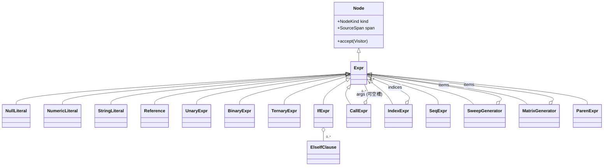

# REL AST 设计

本文档基于 [REL.md](REL.md) 与 [REL_Formal_Spec.md](REL_Formal_Spec.md)，定义 REL 表达式语言的抽象语法树（AST）。
内容包括：设计原则、节点分类与字段、文法到 AST 的映射、辅助枚举、C++ 参考骨架、访问者接口，以及若干求值/构造示例。

---

## 1. 设计原则

1. **从“分析语法”到“抽象语法”**：形式化文法（`REL_Formal_Spec.md`）为消除左递归引入了大量 `*_tail`/`*_opt` 尾递归产生式（如 `additive_tail`、`logical_or_tail`）。这些产生式只服务于解析过程，**不进入 AST**。AST 只保留语义结构。
2. **优先级层折叠**：`logical_or_expr / logical_and_expr / bit_* / equality / relational / shift / additive / multiplicative` 这一整套优先级层，统一折叠为同一个二元节点 `BinaryExpr`，通过算符枚举区分；优先级与结合性由**解析器**保证，AST 不再保留层级名。
3. **关键字算符归一**：`AND`↔`&&`、`OR`↔`||`、`EQUALS`↔`==`、`NOTEQUALS`↔`!=`、`NOT`↔`!` 在 AST 中归一为同一算符。是否来自关键字形式可选地记录在 `token_form` 字段，仅用于诊断/回写，不影响语义。
4. **左结合折叠为左深树**：`a - b - c` ⇒ `((a - b) - c)`；幂 `**` 为**右结合** ⇒ `a ** b ** c` ⇒ `(a ** (b ** c))`；`?:` 为**右结合**。
5. **上下文相关的括号语义在解析期消解**：
   - `( expr )` 作为 primary ⇒ 分组（`ParenExpr`，可选透明化）。
   - `expr ( args )` 作为后缀 ⇒ `CallExpr`（函数调用 / 矩阵按下标索引，二者在 AST 同形，语义在求值期按被调对象类型决定）。
   - `expr [ list ]` 作为后缀 ⇒ `IndexExpr`；`[ list ]` 作为 primary ⇒ `SweepGenerator`。
   - `{ list }` ⇒ `MatrixGenerator`。
6. **短路语义不改变结构**：`&&/AND`、`||/OR` 在 AST 中仍是普通 `BinaryExpr`，右操作数的惰性求值由求值器实现。
7. **源码定位**：每个节点携带 `SourceSpan`（起止偏移/行列），用于错误报告与回写。

---

## 2. 节点总览



| AST 节点 | 来源文法产生式 | 说明 |
|---|---|---|
| `NullLiteral` | `KW_NULL` | 空值字面量 |
| `NumericLiteral` | `<numeric_literal>` | 整数/实数/虚数 + 可选缩放因子/单位后缀 |
| `StringLiteral` | `<string_literal>` / `<raw_string_literal>` | 双引号（转义）/ 双单引号（原样） |
| `Reference` | `<reference>` | 点分标识符路径（`.` / `..`） |
| `UnaryExpr` | `<unary_expr>` | `! / NOT / ~ / 一元 -` |
| `BinaryExpr` | 乘除…逻辑或所有二元层 + `**` | 单节点 + 算符枚举 |
| `TernaryExpr` | `<conditional_tail>`（`?:`） | 右结合三元 |
| `IfExpr` | `<if_expr>` | `if/then/elseif/else` |
| `CallExpr` | `LPAREN <call_arg_list_opt> RPAREN` 后缀 | 调用/索引同形，参数槽可缺省 |
| `IndexExpr` | `LBRACKET <index_list> RBRACKET` 后缀 | sweep 索引 |
| `SeqExpr` | `<seq_expr>`（`::`） | 序列/范围生成 |
| `SweepGenerator` | `<sweep_generator>` | `[ item_list ]` |
| `MatrixGenerator` | `<matrix_generator>` | `{ item_list }` |
| `ParenExpr` | `LPAREN <expr> RPAREN` primary | 分组（可透明化） |

---

## 3. 节点定义（字段级）

### 3.1 基类

- `Node`
  - `NodeKind kind`：节点判别枚举。
  - `SourceSpan span`：`{ uint32 begin; uint32 end; uint32 line; uint32 col; }`。
- `Expr : Node`：所有表达式节点的基类（REL 输入恒为单个表达式，`<input> ::= <expr> <eof>`）。

### 3.2 字面量

- `NullLiteral`：无额外字段。
- `NumericLiteral`
  - `NumericKind numeric_kind`：`Integer | Real | Imaginary`。
  - `IntBase int_base`：`Dec | Hex | Oct`（仅 `Integer` 有意义）。
  - `std::string lexeme`：原始基值文本（不含后缀），用于精确回写与大数保留。
  - `double real_value`：解析后的数值（虚数表示其虚部系数，整数同时可由宿主转 `int64`）。
  - `NumericSuffix suffix`：缩放因子 / 单位 / 预定义缩放单位（见 §4.3）。
- `StringLiteral`
  - `bool raw`：`true` 表示 `'' ... ''` 原样串；`false` 表示 `" ... "` 转义串。
  - `std::string value`：`raw=false` 时为**已解码**值（`\n`、`\xNN`、`\0NNN` 等已展开）；`raw=true` 时为原始字符序列。

> 词法层把 `\x[0-9A-Fa-f]{2}`、`\0[0-7]{3}` 等转义在构造 `StringLiteral` 时一次性解码；原样串不做任何转义。

### 3.3 引用（标识符路径）

- `Reference`
  - `std::vector<RefSegment> segments`，其中
    - `RefSegment { std::string name; SegmentSep sep; }`
    - `SegmentSep sep`：`None`（首段）| `Dot`（`.`）| `DotDot`（`..`，表示该变量在数据集中唯一）。
  - 支持文法 `IDENTIFIER (DOT IDENTIFIER | DDOT IDENTIFIER)*`，覆盖 REL.md 的四种引用形态：
    - `VariableName`
    - `AnalysisName.AnalysisType.VariableName`
    - `DatasetName..VariableName`
    - `DatasetName.AnalysisName.AnalysisType.VariableName`
  - **内建常量**（`PI`、`e`、`ln10`、`boltzmann` 等）在 AST 中即为单段 `Reference`，其值在求值期解析，可被宿主同名绑定遮蔽。

### 3.4 一元 / 二元 / 三元

- `UnaryExpr`
  - `UnaryOp op`：`LogicalNot(!/NOT) | BitNot(~) | Negate(一元 -)`。
  - `Expr* operand`。
  - `TokenForm token_form`：可选，记录 `!` vs `NOT`。
- `BinaryExpr`
  - `BinaryOp op`：见 §4.2（含算术、移位、比较、相等、按位、逻辑、幂）。
  - `Expr* lhs`、`Expr* rhs`。
  - `TokenForm token_form`：可选，记录关键字/符号形式（`AND` vs `&&` 等）。
  - 短路标志由 `op ∈ {LogicalAnd, LogicalOr}` 隐含，无需额外字段。
- `TernaryExpr`（`?:`）
  - `Expr* cond`、`Expr* then_expr`、`Expr* else_expr`（右结合）。

### 3.5 if 表达式

- `IfExpr`
  - `Expr* cond`、`Expr* then_body`。
  - `std::vector<ElseIfClause> elseifs`，`ElseIfClause { Expr* cond; Expr* body; }`。
  - `Expr* else_body`（文法中 `else` 分支为**必选**）。
  - 注意：`if (...) then ... else ...` 是 primary，可无括号嵌入任意算符上下文（如 `a + if (c) then 1 else 2`）。

### 3.6 后缀：调用与索引

- `CallExpr`（`expr ( args )`）
  - `Expr* callee`。
  - `std::vector<Expr*> args`：元素可为 `nullptr`，表示**缺省参数槽**（相邻逗号跳过）。
    - 约束（由解析器校验，AST 仅承载）：纯缺省 `f(,,)` 非法、尾部缺省 `f(,,a,,)` 非法、空列表写作 `f()`。
    - 每个非空槽来自 `<seq_expr>`，因此可能是普通 `Expr` 或 `SeqExpr`（如 `a(1::1::3,3)`）。
- `IndexExpr`（`expr [ list ]`）
  - `Expr* target`。
  - `std::vector<Expr*> indices`：来自 `<index_list>`（即 `item_list`），逗号分隔；元素可为 `SeqExpr`，裸 `::` 表示“该 sweep 维度全选”（`SeqExpr.bare == true`）。
  - 连续后缀（`a[i][j]`、`a(i)(j)`、`a[i](j)`）折叠为 `IndexExpr`/`CallExpr` 的左深嵌套。

### 3.7 序列 / 生成器

- `SeqExpr`（`::` 序列）
  - `Expr* start`（可空）、`Expr* step`（可空）、`Expr* stop`（可空）。
  - `bool bare`：`true` 表示裸 `::`（无任何操作数）。
  - `bool has_step`：区分 `start::stop`（`has_step=false`）与 `start::step::stop`（`has_step=true`）。
  - 形态对应：
    | 写法 | bare | start | step | stop | has_step |
    |---|---|---|---|---|---|
    | `::` | true | ∅ | ∅ | ∅ | false |
    | `start::stop` | false | ✓ | ∅ | ✓ | false |
    | `start::step::stop` | false | ✓ | ✓ | ✓ | true |
  - 语义随上下文：索引上下文裸 `::` = 全选；生成器上下文裸 `::` = 空序列（`[::]` 空 sweep、`{::}` 空矩阵）。
  - 适用范围限制（`[]`/`{}`/`()` 索引或生成器内）由解析器约束，AST 仅承载。
- `SweepGenerator`（`[ item_list ]` 作 primary）
  - `std::vector<Expr*> items`：来自 `<item_list>`，元素可为 `SeqExpr`；空列表见裸 `::`。
- `MatrixGenerator`（`{ item_list }`）
  - `std::vector<Expr*> items`：同上。

### 3.8 分组

- `ParenExpr`（`( expr )`）
  - `Expr* inner`。
  - **可选透明化**：若不需要保留括号用于回写，解析器可直接返回 `inner`，不构造该节点。本设计保留该节点以利于源码往返（round-trip）。

---

## 4. 辅助枚举

### 4.1 NodeKind / UnaryOp

```text
NodeKind = {
  NullLiteral, NumericLiteral, StringLiteral, Reference,
  UnaryExpr, BinaryExpr, TernaryExpr, IfExpr,
  CallExpr, IndexExpr, SeqExpr, SweepGenerator, MatrixGenerator, ParenExpr
}

UnaryOp = { LogicalNot, BitNot, Negate }
```

### 4.2 BinaryOp（含优先级与结合性参考）

> 优先级/结合性仅供解析器构树参考，数值越小优先级越高（与 REL.md 优先级表方向一致）。

| BinaryOp | 符号 | 关键字别名 | 优先级 | 结合性 |
|---|---|---|---|---|
| `Pow` | `**` | — | 2 | 右 |
| `Mul` | `*` | — | 4 | 左 |
| `Div` | `/` | — | 4 | 左 |
| `Mod` | `%` | — | 4 | 左 |
| `Add` | `+` | — | 5 | 左 |
| `Sub` | `-` | — | 5 | 左 |
| `Shl` | `<<` | — | 6 | 左 |
| `Shr` | `>>` | — | 6 | 左 |
| `Lt` | `<` | — | 7 | 左 |
| `Le` | `<=` | — | 7 | 左 |
| `Gt` | `>` | — | 7 | 左 |
| `Ge` | `>=` | — | 7 | 左 |
| `Eq` | `==` | `EQUALS` | 8 | 左 |
| `Ne` | `!=` | `NOTEQUALS` | 8 | 左 |
| `BitAnd` | `&` | — | 9 | 左 |
| `BitXor` | `^` | — | 10 | 左 |
| `BitOr` | `\|` | — | 11 | 左 |
| `LogicalAnd` | `&&` | `AND` | 12 | 左（短路） |
| `LogicalOr` | `\|\|` | `OR` | 13 | 左（短路） |

> 三元 `?:`（优先级 14，右结合）→ `TernaryExpr`；一元 `! / NOT / ~ / -`（优先级 3，前缀）→ `UnaryExpr`。

### 4.3 数值后缀枚举

```text
NumericKind = { Integer, Real, Imaginary }
IntBase     = { Dec, Hex, Oct }
SegmentSep  = { None, Dot, DotDot }
TokenForm   = { Symbol, Keyword }      // 仅诊断用

ScaleFactor = { T, G, M, K, k, Underscore(_), m, u, n, p, f, a }   // 10^12 ... 10^-18
Unit        = { Hz, Ohm, Ohms, S, F, H, meter, meters, metre, metres, sec, V, A, W }
PredefScaledUnit = { mil, mils, in, ft, mi, cm, PHz, dB, nmi }
```

`NumericSuffix` 结构：

```text
NumericSuffix {
  enum Kind { None, ScaleOnly, UnitOnly, ScaleAndUnit, Predef } kind;
  ScaleFactor      scale;   // kind ∈ {ScaleOnly, ScaleAndUnit}
  Unit             unit;    // kind ∈ {UnitOnly, ScaleAndUnit}
  PredefScaledUnit predef;  // kind == Predef
}
```

对应文法 `<numeric_suffix> ::= <predefined_scaled_unit> | <scale_factor> <unit_opt> | <unit>`，并满足约束：命中 `predef` 时不得再叠加 `scale`/`unit`；`scale` 必在 `unit` 前；大小写严格敏感。

---

## 5. 文法 → AST 映射（折叠规则）

| 文法（优先级层 + 尾递归） | 折叠后的 AST |
|---|---|
| `conditional_expr` + `conditional_tail`（`?:`） | `TernaryExpr`（无 `?:` 时透传） |
| `logical_or_expr` + `logical_or_tail`（`\|\| / OR`） | 左深 `BinaryExpr(LogicalOr)` |
| `logical_and_expr` + `logical_and_tail`（`&& / AND`） | 左深 `BinaryExpr(LogicalAnd)` |
| `bit_or/xor/and_expr` + `*_tail` | 左深 `BinaryExpr(BitOr/BitXor/BitAnd)` |
| `equality_expr` + `equality_tail` | 左深 `BinaryExpr(Eq/Ne)` |
| `relational_expr` + `relational_tail` | 左深 `BinaryExpr(Lt/Le/Gt/Ge)` |
| `shift_expr` + `shift_tail` | 左深 `BinaryExpr(Shl/Shr)` |
| `additive_expr` + `additive_tail` | 左深 `BinaryExpr(Add/Sub)` |
| `multiplicative_expr` + `multiplicative_tail` | 左深 `BinaryExpr(Mul/Div/Mod)` |
| `unary_expr`（前缀链） | 嵌套 `UnaryExpr` |
| `power_expr` + `power_tail`（`**`） | 右结合 `BinaryExpr(Pow)`（无 `**` 时透传 `postfix_expr`） |
| `postfix_expr` + `postfix_tail`（`[]`/`()` 链） | 左深 `IndexExpr`/`CallExpr` |
| `primary_expr` 各分支 | 对应叶/复合节点 |
| `seq_expr` / `seq_tail` / `seq_stop_opt` | `SeqExpr`（仅当出现 `::`；否则透传内层 `Expr`） |
| `item_list` / `index_list` / `call_arg_list` | 节点的子表（`vector<Expr*>`，调用允许 `nullptr` 槽） |

**透传（pass-through）规则**：当某优先级层只匹配到“单个下层、尾部为空”时，不创建节点，直接返回下层结果，避免一连串单子节点包装。

---

## 6. C++ 参考骨架

> 命名空间 `rel::ast`；内存所有权建议用 `std::unique_ptr` 持有子节点，下方为简化示意（用裸 `ExprPtr` 别名表达拥有语义）。

```cpp
#pragma once
#include <cstdint>
#include <memory>
#include <string>
#include <vector>

namespace rel::ast {

struct SourceSpan { uint32_t begin{}, end{}, line{}, col{}; };

enum class NodeKind {
  NullLiteral, NumericLiteral, StringLiteral, Reference,
  UnaryExpr, BinaryExpr, TernaryExpr, IfExpr,
  CallExpr, IndexExpr, SeqExpr, SweepGenerator, MatrixGenerator, ParenExpr,
};

enum class UnaryOp { LogicalNot, BitNot, Negate };
enum class BinaryOp {
  Pow, Mul, Div, Mod, Add, Sub, Shl, Shr,
  Lt, Le, Gt, Ge, Eq, Ne, BitAnd, BitXor, BitOr,
  LogicalAnd, LogicalOr,
};

enum class NumericKind { Integer, Real, Imaginary };
enum class IntBase { Dec, Hex, Oct };
enum class SegmentSep { None, Dot, DotDot };
enum class TokenForm { Symbol, Keyword };

enum class ScaleFactor { T, G, M, K_upper, k_lower, Underscore, m, u, n, p, f, a };
enum class Unit { Hz, Ohm, Ohms, S, F, H, meter, meters, metre, metres, sec, V, A, W };
enum class PredefScaledUnit { mil, mils, in_, ft, mi, cm, PHz, dB, nmi };

struct NumericSuffix {
  enum class Kind { None, ScaleOnly, UnitOnly, ScaleAndUnit, Predef } kind{Kind::None};
  ScaleFactor scale{};
  Unit unit{};
  PredefScaledUnit predef{};
};

struct Visitor;  // 见 §7

struct Node {
  NodeKind kind;
  SourceSpan span;
  explicit Node(NodeKind k) : kind(k) {}
  virtual ~Node() = default;
  virtual void accept(Visitor& v) = 0;
};
using NodePtr = std::unique_ptr<Node>;

struct Expr : Node { using Node::Node; };
using ExprPtr = std::unique_ptr<Expr>;

struct NullLiteral final : Expr {
  NullLiteral() : Expr(NodeKind::NullLiteral) {}
  void accept(Visitor&) override;
};

struct NumericLiteral final : Expr {
  NumericKind numeric_kind{};
  IntBase int_base{IntBase::Dec};
  std::string lexeme;     // 原始基值文本
  double real_value{};    // 虚数则为虚部系数
  NumericSuffix suffix{};
  NumericLiteral() : Expr(NodeKind::NumericLiteral) {}
  void accept(Visitor&) override;
};

struct StringLiteral final : Expr {
  bool raw{false};        // true: '' .. ''
  std::string value;      // 已解码（raw=false）/ 原样（raw=true）
  StringLiteral() : Expr(NodeKind::StringLiteral) {}
  void accept(Visitor&) override;
};

struct RefSegment { std::string name; SegmentSep sep{SegmentSep::None}; };
struct Reference final : Expr {
  std::vector<RefSegment> segments;
  Reference() : Expr(NodeKind::Reference) {}
  void accept(Visitor&) override;
};

struct UnaryExpr final : Expr {
  UnaryOp op{};
  ExprPtr operand;
  TokenForm token_form{TokenForm::Symbol};
  UnaryExpr() : Expr(NodeKind::UnaryExpr) {}
  void accept(Visitor&) override;
};

struct BinaryExpr final : Expr {
  BinaryOp op{};
  ExprPtr lhs, rhs;
  TokenForm token_form{TokenForm::Symbol};
  BinaryExpr() : Expr(NodeKind::BinaryExpr) {}
  void accept(Visitor&) override;
};

struct TernaryExpr final : Expr {
  ExprPtr cond, then_expr, else_expr;
  TernaryExpr() : Expr(NodeKind::TernaryExpr) {}
  void accept(Visitor&) override;
};

struct ElseIfClause { ExprPtr cond, body; };
struct IfExpr final : Expr {
  ExprPtr cond, then_body, else_body;
  std::vector<ElseIfClause> elseifs;
  IfExpr() : Expr(NodeKind::IfExpr) {}
  void accept(Visitor&) override;
};

struct CallExpr final : Expr {
  ExprPtr callee;
  std::vector<ExprPtr> args;  // 元素可空 = 缺省参数槽
  CallExpr() : Expr(NodeKind::CallExpr) {}
  void accept(Visitor&) override;
};

struct IndexExpr final : Expr {
  ExprPtr target;
  std::vector<ExprPtr> indices;  // 可含 SeqExpr；裸 :: 见 SeqExpr.bare
  IndexExpr() : Expr(NodeKind::IndexExpr) {}
  void accept(Visitor&) override;
};

struct SeqExpr final : Expr {
  ExprPtr start, step, stop;  // 可空
  bool bare{false};
  bool has_step{false};
  SeqExpr() : Expr(NodeKind::SeqExpr) {}
  void accept(Visitor&) override;
};

struct SweepGenerator final : Expr {
  std::vector<ExprPtr> items;
  SweepGenerator() : Expr(NodeKind::SweepGenerator) {}
  void accept(Visitor&) override;
};

struct MatrixGenerator final : Expr {
  std::vector<ExprPtr> items;
  MatrixGenerator() : Expr(NodeKind::MatrixGenerator) {}
  void accept(Visitor&) override;
};

struct ParenExpr final : Expr {   // 可选；解析器可透明化
  ExprPtr inner;
  ParenExpr() : Expr(NodeKind::ParenExpr) {}
  void accept(Visitor&) override;
};

}  // namespace rel::ast
```

---

## 7. 访问者接口

```cpp
namespace rel::ast {

struct Visitor {
  virtual ~Visitor() = default;
  virtual void visit(NullLiteral&)     = 0;
  virtual void visit(NumericLiteral&)  = 0;
  virtual void visit(StringLiteral&)   = 0;
  virtual void visit(Reference&)       = 0;
  virtual void visit(UnaryExpr&)       = 0;
  virtual void visit(BinaryExpr&)      = 0;
  virtual void visit(TernaryExpr&)     = 0;
  virtual void visit(IfExpr&)          = 0;
  virtual void visit(CallExpr&)        = 0;
  virtual void visit(IndexExpr&)       = 0;
  virtual void visit(SeqExpr&)         = 0;
  virtual void visit(SweepGenerator&)  = 0;
  virtual void visit(MatrixGenerator&) = 0;
  virtual void visit(ParenExpr&)       = 0;
};

// 每个节点的 accept 形如：
// void BinaryExpr::accept(Visitor& v) { v.visit(*this); }

}  // namespace rel::ast
```

典型消费者：求值器（`Evaluator`）、类型/量纲检查器、回写打印器（`Printer`）、常量折叠优化器。

---

## 8. 构造示例

### 8.1 `a + b / c`

左结合 + 优先级：`/` 高于 `+`。

```text
BinaryExpr(Add)
├─ lhs: Reference[a]
└─ rhs: BinaryExpr(Div)
        ├─ lhs: Reference[b]
        └─ rhs: Reference[c]
```

### 8.2 `2 ** 3 ** 2`（右结合）

```text
BinaryExpr(Pow)
├─ lhs: NumericLiteral(Integer, 2)
└─ rhs: BinaryExpr(Pow)
        ├─ lhs: NumericLiteral(Integer, 3)
        └─ rhs: NumericLiteral(Integer, 2)
```

### 8.3 `1.23MHz`

```text
NumericLiteral
├─ numeric_kind = Real
├─ lexeme = "1.23"
├─ real_value = 1.23
└─ suffix = { kind=ScaleAndUnit, scale=M, unit=Hz }
```

### 8.4 `DatasetA..Vout`

```text
Reference
├─ segment[0]: { name="DatasetA", sep=None }
└─ segment[1]: { name="Vout",     sep=DotDot }
```

### 8.5 `a[1::1::3, ::]`

```text
IndexExpr
├─ target: Reference[a]
└─ indices:
   ├─ SeqExpr { start=1, step=1, stop=3, has_step=true, bare=false }
   └─ SeqExpr { bare=true }        // 该维度全选
```

### 8.6 `func(,,a)`（前置缺省槽）

```text
CallExpr
├─ callee: Reference[func]
└─ args: [ nullptr, nullptr, Reference[a] ]
```

### 8.7 `if (x > 0) then 1 elseif (x < 0) then -1 else 0`

```text
IfExpr
├─ cond: BinaryExpr(Gt, Reference[x], NumericLiteral(0))
├─ then_body: NumericLiteral(1)
├─ elseifs[0]:
│   ├─ cond: BinaryExpr(Lt, Reference[x], NumericLiteral(0))
│   └─ body: UnaryExpr(Negate, NumericLiteral(1))
└─ else_body: NumericLiteral(0)
```

### 8.8 `a + (c ? 1 : 2)`

```text
BinaryExpr(Add)
├─ lhs: Reference[a]
└─ rhs: ParenExpr
        └─ inner: TernaryExpr
                  ├─ cond: Reference[c]
                  ├─ then_expr: NumericLiteral(1)
                  └─ else_expr: NumericLiteral(2)
```

---

## 9. 设计要点小结

- AST 仅保留**语义结构**，丢弃所有 `*_tail`/`*_opt` 解析脚手架。
- 全部二元优先级层折叠为单一 `BinaryExpr` + 算符枚举；`**` 与 `?:` 右结合，其余二元左结合。
- 关键字算符（`AND/OR/NOT/EQUALS/NOTEQUALS`）与符号算符归一，可选保留 `TokenForm` 供诊断/回写。
- 括号、调用、索引、生成器的上下文歧义在**解析期**消解为不同节点；调用与矩阵下标索引在 AST 同形（`CallExpr`），语义在求值期决定。
- `SeqExpr` 用 `bare`/`has_step` 精确表达 `::`、`start::stop`、`start::step::stop` 三态，并承载“全选/空序列”的上下文语义。
- 数值后缀（缩放因子 / 单位 / 预定义缩放单位）作为 `NumericLiteral.suffix` 一等承载，供后续量纲推导。
