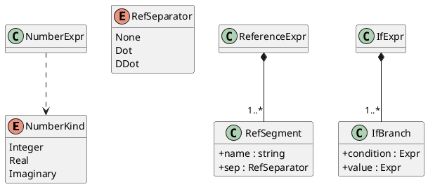
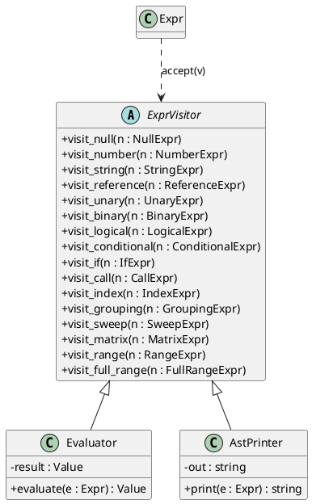
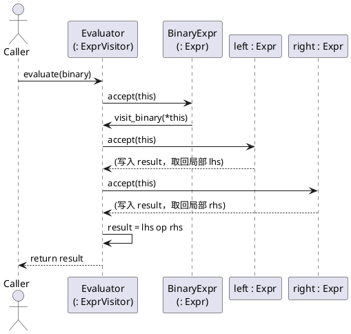

# REL AST 设计文档

本文件描述 REL（ResultsView Expression Language）抽象语法树（AST）的设计，
作为语法分析、求值与工具链开发的公共参考。AST 严格对应
[REL_Formal_Spec.md](REL_Formal_Spec.md) 第 2 节的 BNF 文法与
[REL.md](REL.md) 的语言特性。

> 词法记号定义见 [src/scanner/token.h](src/scanner/token.h)。AST 是语法分析器
> （parser）的输出，求值器（evaluator）及其它遍历工具的输入。

---

## 1. 设计目标与原则

1. **文法驱动**：每一类 AST 节点都可追溯到 Spec 2 中的一条产生式，不引入
   文法之外的结构。
2. **统一节点层次**：所有节点派生自同一抽象基类 `Expr`，形成单一的表达式
   树；遍历逻辑与节点结构解耦。
3. **表达式即一切**：REL 是纯表达式 DSL（单个 `<expr>` 即一次完整输入，见
   Spec 2.1），不存在语句层次，整棵 AST 只有 `Expr` 一种基类。
4. **明确所有权**：节点对子节点持独占所有权，AST 为一棵有向树，生命周期
   随根节点自动管理。
5. **保留源码位置**：每个节点携带行/列定位信息，用于求值期诊断与错误
   报告，复用 [Token](src/scanner/token.h) 已有的位置信息。
6. **大小写敏感、算符别名归一**：`AND`/`&&`、`OR`/`||`、`NOT`/`!`、
   `EQUALS`/`==`、`NOTEQUALS`/`!=` 在 AST 层归一为同一算符语义，但保留触发
   它的原始记号以便回显（见 Spec 2.3/2.4/2.5）。

---

## 2. 核心设计思想

### 2.1 节点与遍历分离（访问者模式）

AST 的结构（节点种类与字段）相对稳定，而作用在 AST 上的操作会不断增加：
求值、打印、类型检查、单位推导、优化……为避免每新增一种操作就修改所有
节点类，采用**访问者模式**将“数据结构”与“操作”解耦：

- 每个节点只暴露一个统一的 `accept(visitor)` 入口；
- 所有具体操作集中在各自的**访问者**实现里（求值器、打印器等）；
- 节点通过 `accept` 回调访问者中与自身类型匹配的 `visit_*` 方法，完成
  **双分派**（运行期既按访问者类型、又按节点类型选择行为）。

这样新增一种遍历操作只需新增一个访问者，无需触碰节点定义；而访问者接口
为每种节点声明一个 `visit_*`，新增节点种类时编译器会强制所有访问者补齐
实现，获得**穷尽性检查**。

### 2.2 访问者的结果传递

访问者接口的 `visit_*` 不携带返回值，遍历结果由**各访问者自身**承载，而非
写回 AST 节点——AST 是只读的、可被多个访问者共享的结构。

- 每个访问者内部持有一个**固定类型**的结果载体（求值器为多维数据
  `Value`，打印器为字符串），类型在编译期确定，无需类型擦除设施，兼容
  C++11。
- 访问者对外暴露一个统一入口（如 `evaluate(expr)` / `print(expr)`）：内部
  触发 `expr.accept(*this)`，再取回结果载体的值返回。
- 该载体仅是“最近一次 `visit_*` 的产物”的临时中转，**不是缓存**。递归处理
  子节点时，每个子节点恰好遍历一次，并立即把结果取到局部变量，避免被
  后续遍历覆盖。因此该机制既不会重复计算，也不会读到过期结果。

> 标准 AST 为树形结构（每个节点唯一父亲），天然不存在共享子树，正常遍历
> 下不会重复求值。若未来引入公共子表达式消除等 DAG 优化，再由相应访问者
> 自行引入备忘表，与节点设计无关。

---

## 3. 类图

### 3.1 节点层次

```plantuml
@startuml
skinparam classAttributeIconSize 0
hide empty members

abstract class Expr {
  +line : int
  +column : int
  +accept(v : ExprVisitor)
}

' --- 字面量 (Spec 2.7) ---
class NullExpr
class NumberExpr {
  +kind : NumberKind
  +base_lexeme : string
  +radix : int
  +scale_factor : string
  +unit : string
  +predefined_unit : bool
}
class StringExpr {
  +value : string
  +raw : bool
}

' --- 引用 (Spec 2.7) ---
class ReferenceExpr {
  +segments : RefSegment[]
}

' --- 运算 (Spec 2.2-2.5) ---
class UnaryExpr {
  +op : TokenType
  +operand : Expr
}
class BinaryExpr {
  +op : TokenType
  +left : Expr
  +right : Expr
}
class LogicalExpr {
  +op : TokenType
  +left : Expr
  +right : Expr
}
class ConditionalExpr {
  +condition : Expr
  +then_branch : Expr
  +else_branch : Expr
}

' --- 条件 (Spec 2.2) ---
class IfExpr {
  +branches : IfBranch[]
  +else_value : Expr
}

' --- 后缀 (Spec 2.6) ---
class CallExpr {
  +callee : Expr
  +args : Expr[]
}
class IndexExpr {
  +object : Expr
  +indices : Expr[]
}

' --- 分组与生成器 (Spec 2.6) ---
class GroupingExpr {
  +inner : Expr
}
class SweepExpr {
  +items : Expr[]
}
class MatrixExpr {
  +items : Expr[]
}

' --- 序列 (Spec 2.6) ---
class RangeExpr {
  +start : Expr
  +step : Expr
  +stop : Expr
}
class FullRangeExpr

Expr <|-- NullExpr
Expr <|-- NumberExpr
Expr <|-- StringExpr
Expr <|-- ReferenceExpr
Expr <|-- UnaryExpr
Expr <|-- BinaryExpr
Expr <|-- LogicalExpr
Expr <|-- ConditionalExpr
Expr <|-- IfExpr
Expr <|-- CallExpr
Expr <|-- IndexExpr
Expr <|-- GroupingExpr
Expr <|-- SweepExpr
Expr <|-- MatrixExpr
Expr <|-- RangeExpr
Expr <|-- FullRangeExpr
@enduml
```

辅助数据结构（非 `Expr` 节点，作为字段聚合在节点内）：

### 3.2 访问者层次

### 3.3 双分派交互

---

## 4. 节点说明

下表汇总各节点及其对应文法。所有子节点字段均为对 `Expr` 的独占持有；标注
“可空”的字段表示该子节点可缺省。

| 节点 | 文法依据 | 关键字段 | 说明 |
|---|---|---|---|
| `NullExpr` | Spec 2.7 `KW_NULL` | — | `NULL` 字面量 |
| `NumberExpr` | Spec 2.7 `<numeric_literal>` | `kind` / `base_lexeme` / `radix` / `scale_factor` / `unit` / `predefined_unit` | 数值字面量，携带进制、缩放因子与物理单位信息 |
| `StringExpr` | Spec 2.7 `<string_literal>` / `<raw_string_literal>` | `value` / `raw` | 普通字符串按 Spec 1.3 解码转义；原始字符串 verbatim |
| `ReferenceExpr` | Spec 2.7 `<reference>` | `segments` | 点分多段引用；内建常量（`PI`/`e`…）亦归此类，求值期解析 |
| `UnaryExpr` | Spec 2.5 `<unary_op>` | `op` / `operand` | 前缀 `!` `NOT` `~` `-` |
| `BinaryExpr` | Spec 2.3–2.5 | `op` / `left` / `right` | 除短路逻辑与三元外的全部二元算符，统一左结合 |
| `LogicalExpr` | Spec 2.3 | `op` / `left` / `right` | `&&`/`AND`、`\|\|`/`OR`，需短路求值 |
| `ConditionalExpr` | Spec 2.2 `<conditional_expr>` | `condition` / `then_branch` / `else_branch` | 三元 `?:` |
| `IfExpr` | Spec 2.2 `<if_expr>` | `branches` / `else_value` | `if-then-elseif-else`，`else` 必选 |
| `CallExpr` | Spec 2.6 `<postfix_tail>` | `callee` / `args` | 函数调用或矩阵索引；`args` 中空槽表示缺省参数 |
| `IndexExpr` | Spec 2.6 `<postfix_tail>` | `object` / `indices` | sweep 索引，可连用，索引项可为序列 |
| `GroupingExpr` | Spec 2.6 `( expr )` | `inner` | 分组，保真打印用；求值等价于内部表达式 |
| `SweepExpr` | Spec 2.6 `<sweep_generator>` | `items` | `[ ... ]` 生成器，拼接为一个 sweep |
| `MatrixExpr` | Spec 2.6 `<matrix_generator>` | `items` | `{ ... }` 生成器，拼接为一个矩阵 |
| `RangeExpr` | Spec 2.6 `<seq_expr>` | `start` / `step`（可空）/ `stop` | `start::stop` 或 `start::step::stop` |
| `FullRangeExpr` | Spec 2.6 `<seq_expr> ::= OP_SEQ` | — | 裸序列 `::`，仅索引上下文合法 |

辅助字段的取值约定：

- `NumberExpr.kind` 取 `Integer` / `Real` / `Imaginary`，由词法 `NUMERIC_BASE`
  形态决定（Spec 1.4 / 1.7 规则 2）；`radix` 取 `10` / `16` / `8`，仅整数有意义。
- `ReferenceExpr.segments` 为有序段序列，每段记录段名与其“前置分隔符”
  （首段无、`.` 或 `..`），覆盖 [REL.md](REL.md) 中四种引用形态。
- `*.op` 字段保存触发该节点的原始记号（`TokenType`），用于区分 `&&`/`AND`
  等别名的书写形式。

补充约束（由 parser 在构造期保证，AST 仅忠实保存结构）：

- **缺省参数槽**：`func(,,a)` 合法；纯缺省 `func(,,)`、尾部缺省 `func(,,a,,)`
  非法（[REL.md](REL.md) 函数一节）。
- **裸序列**：`::` 仅出现在索引上下文（如 `a[::, 1]`）；出现在 `[]` / `{}`
  生成器中非法。
- **数值后缀**：`scale_factor` 在前、`unit` 在后；命中 `predefined_scaled_unit`
  后不再叠加缩放因子或单位（Spec 1.5）。

---

## 5. 设计取舍

### 5.1 访问者返回值

`visit_*` 返回 `void`、结果由访问者成员承载，是为兼容 C++11（无类型擦除
设施）并保持所有访问者签名一致；每个访问者的结果类型在编译期固定（求值器
为 `Value`，打印器为字符串）。若未来某访问者需返回多种类型，可在其内部叠加
多个结果载体，无需改动 AST 或访问者接口。

### 5.2 节点拆分粒度

- 字面量按 `NullExpr` / `NumberExpr` / `StringExpr` 拆分而非合并为单一
  `Literal`，因为数值字面量需携带缩放因子、单位、进制等结构化信息。
- `LogicalExpr` 从 `BinaryExpr` 独立，在类型层面提示求值器实现短路语义。
- `RangeExpr` 与 `FullRangeExpr` 分离：裸 `::` 无子表达式，单独成类使
  “仅索引上下文合法”的约束更清晰。

### 5.3 算符别名归一

`AND`/`&&` 等别名在 AST 层不再区分语义，但 `op` 字段保留触发它的原始记号，
用于保真打印与错误信息回显原始写法。

### 5.4 错误恢复

parser 在语法错误时不构造半成品节点，本设计不引入 `ErrorExpr` 占位节点；
诊断由 parser 直接产出，与 scanner 现有“产生 `INVALID` 记号、收集多条诊断”
的策略一致（见 [src/scanner/scanner.h](src/scanner/scanner.h)）。若后续需要
容错式编辑器场景，可再补充 `ErrorExpr`。
